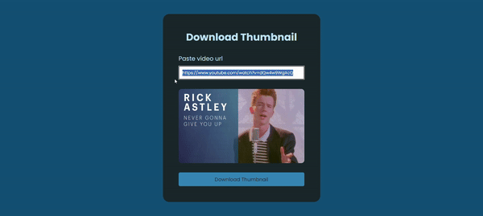

# Thumbnail-Downloader

## 💻 Sobre o Projeto

Este parece ser um pequeno aplicativo da web que permite ao usuário fazer o download de miniaturas de vídeos do YouTube ou imagens de outros URLs de imagem. O usuário cola o URL do vídeo ou da imagem em um campo de entrada, e o aplicativo exibe uma pré-visualização da miniatura ou imagem. Após a visualização, o usuário pode fazer o download da miniatura ou imagem clicando em um botão.

## 📚 Tecnologias

- HTML
- CSS
- Git e Github
- javascript
- PHP

## ⚖ Licença

Esse projeto está sob a licença MIT.

Elaborado por [Leandro Amaral](https://github.com/Leanddo)